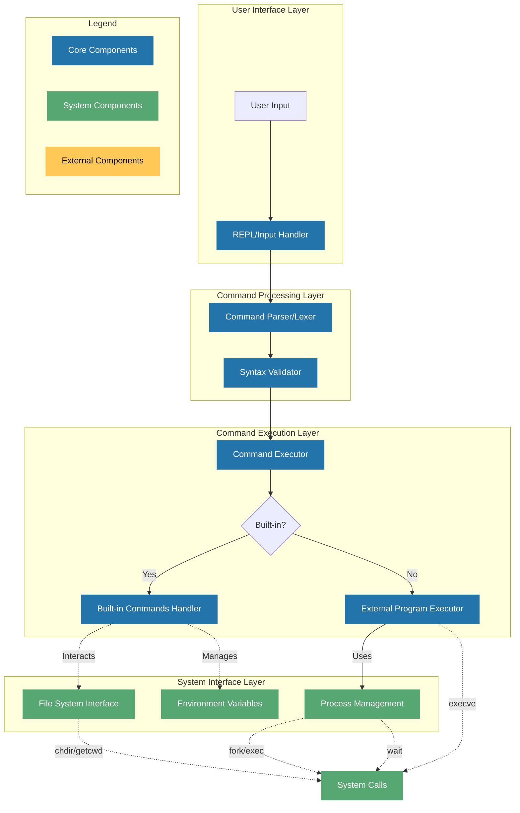

This is a starting point for C solutions to the
["Build Your Own Shell" Challenge](https://app.codecrafters.io/courses/shell/overview).

In this challenge, you'll build your own POSIX compliant shell that's capable of
interpreting shell commands, running external programs and builtin commands like
cd, pwd, echo and more. Along the way, you'll learn about shell command parsing,
REPLs, builtin commands, and more.

**Note**: If you're viewing this repo on GitHub, head over to
[codecrafters.io](https://codecrafters.io) to try the challenge.

1. ensure you have `c` installed locally
2. run `./your_program.sh` to run your program, which is implemented in
   `app/main.c`.

